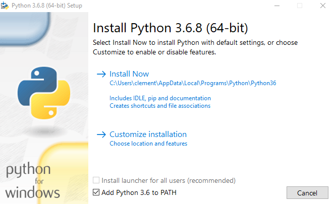

# Welcome to pyLong project

Visit the online documentation to learn more about **pyLong** : https://pylong.readthedocs.io/en/latest/

## Instructions to build **pyLong** from sources

### On Windows

* Install *python 3.6.8* : https://www.python.org/downloads/release/python-368/

* Download *pyLong repository* : https://github.com/clementroussel/pyLong/archive/refs/heads/main.zip
* Unzip the archive and keep only *src* and *requirements* folders
* Launch a terminal by typing *cmd* in the address bar
* Create a virtual environment with *python venv module*

    >>> py -3.6 -m venv pyLong-env

* Activate it with

   >>> pyLong-venv\Scripts\activated

* Install *pyLong* dependancies using *pip*

